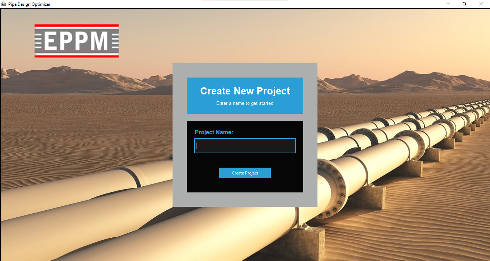
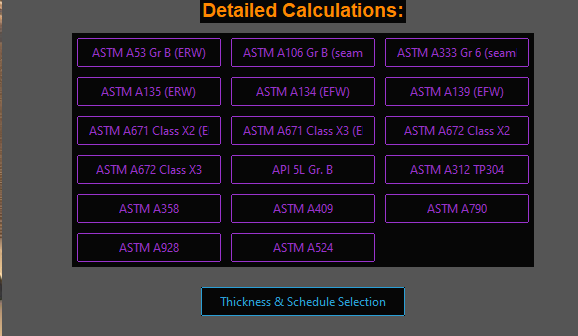

# Pipeline Design Optimizer 🚀

A professional desktop application for optimizing pipeline design with comprehensive hydraulic analysis, material selection, and automated report generation.


## 📋 Table of Contents

- [Overview](#overview)
- [Features](#features)
- [Installation](#installation)
- [Usage](#usage)
- [Technical Details](#technical-details)
- [File Structure](#file-structure)
- [Data Requirements](#data-requirements)
- [Report Generation](#report-generation)
- [Screenshots](#Screenshots)
- [Contributing](#contributing)
- [License](#license)
- [Support](#support)

## 🔍 Overview

Pipeline Design Optimizer is a comprehensive engineering tool that automates the complex process of pipeline design optimization. It performs hydraulic calculations, material compatibility analysis, pressure drop computations, and generates professional PDF reports with detailed engineering specifications.

### Key Capabilities:
- **Hydraulic Analysis**: Velocity and pressure drop calculations
- **Material Selection**: Automated compatibility checking
- **Cost Optimization**: Economic analysis with material pricing
- **Professional Reporting**: Automated PDF report generation
- **Standards Compliance**: API specification integration

## ✨ Features

### Core Functionality
- **Multi-Phase Support**: Handles both liquid and gas pipelines
- **Interactive GUI**: Modern, user-friendly interface with ttkbootstrap
- **Real-time Calculations**: Instant feedback on design parameters
- **Progressive Workflow**: Step-by-step design process

### Engineering Features
- **Velocity Optimization**: Critical diameter calculation based on velocity constraints
- **Pressure Drop Analysis**: Comprehensive hydraulic calculations including fittings
- **Material Compatibility**: Temperature and pressure range validation
- **Wall Thickness Design**: API-compliant thickness calculations
- **Schedule Selection**: Automated pipe schedule matching

### Advanced Features
- **Multi-threading**: Background calculations with progress indicators
- **Custom Fluid Addition**: Dynamic fluid property management
- **Fitting Database**: Comprehensive loss coefficient library
- **Cost Analysis**: Material and installation cost estimation
- **Professional Reports**: Corporate-styled PDF documentation

## 🛠 Installation

### Prerequisites
```bash
Python 3.8 or higher
pip package manager
```

### Required Dependencies
Install all required packages using:

```bash
pip install -r requirements.txt
```

### requirements.txt
```
ttkbootstrap>=1.5.1
pandas>=1.3.0
numpy>=1.21.0
matplotlib>=3.4.0
Pillow>=8.3.0
reportlab>=3.6.0
openpyxl>=3.0.9
```

### Optional: Create Executable
```bash
pip install pyinstaller
pyinstaller --onefile --windowed --icon="Pipe Design Optimizer.ico" main.py
```

## 📖 Usage

### Quick Start
1. **Launch Application**: Run `python main.py`
2. **Create Project**: Enter project name on welcome screen
3. **Input Parameters**: Fill in pipeline specifications
4. **Calculate**: Run hydraulic analysis
5. **Generate Report**: Create professional PDF documentation

### Detailed Workflow

#### 1. Project Setup
- Enter unique project name
- Application creates project workspace

#### 2. Design Parameters
**Basic Parameters:**
- Flowrate (m³/h)
- Pipe Length (m)

**Fluid Properties:**
- Phase (Liquid/Gas)
- Fluid Type (select from database or add custom)
- Location Type (building density)

**Operating Conditions:**
- Maximum Velocity (m/s)
- Temperature (°C)
- Operating Pressure (bar)
- Design Pressure (bar)
- Corrosion Allowance (mm)

#### 3. Hydraulic Analysis
- **Velocity Analysis**: Calculates critical diameter based on velocity limits
- **Pressure Drop Calculation**: Computes total pressure loss including fittings
- **Interactive Charts**: Visual analysis with matplotlib plots

#### 4. Material Selection
- Automatic compatibility checking
- Temperature/pressure range validation
- Multiple material comparison

#### 5. Thickness & Schedule
- API-compliant wall thickness calculation
- Automated schedule selection
- Standard specification matching

#### 6. Cost Analysis
- Material cost estimation
- Fitting cost calculation
- Total project cost optimization

#### 7. Report Generation
- Professional PDF output
- Corporate branding
- Comprehensive technical documentation

## 🔧 Technical Details

### Calculation Methods

#### Hydraulic Calculations
```python
# Velocity calculation
V = Q / A = Q / (π * D² / 4)

# Reynolds number
Re = ρ * V * D / μ

# Friction factor (Colebrook-White equation)
1/√f = -2 * log10((ε/D)/3.7 + 2.51/(Re√f))
```

#### Pressure Drop
```python
# Linear pressure drop
ΔP_linear = f * (L/D) * ρ * v²/2

# Singular pressure drop (fittings)
ΔP_singular = Σ(K * ρ * v²/2)
```

#### Wall Thickness (API Standards)
```python
# Required thickness
t = (P * D) / (2 * S * E - 2 * P) + CA

# Where:
# P = Design pressure
# D = Outside diameter
# S = Allowable stress
# E = Weld joint factor
# CA = Corrosion allowance
```

### Software Architecture

#### Class Structure
```
PipeDesignOptimizerApp (Main Application)
├── Project Management
├── Input Validation
├── Calculation Engine
├── Report Generator
└── GUI Controllers
```

#### Key Methods
- `process_input()`: Validates and processes design parameters
- `calculate_pressure_drop()`: Performs hydraulic calculations
- `create_thickness_schedule_page()`: Determines pipe specifications
- `generate_report()`: Creates PDF documentation
- `build_pipeline_report()`: ReportLab PDF generation

## 📁 File Structure

```
Pipeline-Design-Optimizer/
│
├── main.py                    # Main application file
├── requirements.txt           # Python dependencies
├── README.md                  # This file
│
├── Data Files/
│   ├── liquid_properties.xlsx     # Liquid fluid database
│   ├── gas_properties.xlsx        # Gas fluid database
│   ├── material_properties.xlsx   # Material specifications
│   ├── fittings.xlsx              # Fitting loss coefficients
│   └── schedule.xlsx              # Pipe schedule data
│
├── Assets/
│   ├── Pipe Design Optimizer.ico  # Application icon
│   ├── Pipe Design Optimizer.png  # Application logo
│   ├── bg_eppm.png               # Background image
│   └── eppm.png                  # Company logo for reports
│
├── report_imgs/               # Generated plot storage
│   ├── velocity_vs_diameter.png
│   ├── pressure_drop_vs_diameter.png
│   └── combined_plots.png
│
└── Reports/                   # Generated PDF reports
    └── [Project Name]_report.pdf
```

## 📊 Data Requirements

### Fluid Properties (Excel Format)

#### Liquid Properties
| Liquid | Density (kg/m³) | Viscosity (mPa·s) |
|--------|-----------------|-------------------|
| Water  | 1000            | 1.0               |
| Oil    | 850             | 5.2               |

#### Gas Properties
| Gas | Density (kg/m³) | Viscosity (μPa·s) |
|-----|-----------------|-------------------|
| Air | 1.225           | 18.1              |
| CO2 | 1.842           | 15.0              |

### Material Properties
| Material | Specification | Weld Joint Factor (E) | SMYS (MPa) | Roughness (mm) | Pressure Min | Pressure Max | Temperature Min | Temperature Max | Price |
|----------|---------------|----------------------|------------|----------------|--------------|--------------|-----------------|-----------------|-------|
| Steel    | API 5L Gr.B   | 1.0                  | 241        | 0.046          | 0            | 100          | -29             | 200             | 2.5   |

### Fitting Database
| Fitting Type | K1 | K∞ | Kd | Price |
|--------------|----|----|----|-------|
| 90° Elbow    | 0.1| 0.2| 0.5| 15.0  |
| Gate Valve   | 0.05|0.1| 0.3| 120.0 |

### Schedule Data
| Nominal size (inches) | Outside diameter (mm) | Wall thickness (mm) | Specif. API |
|----------------------|----------------------|---------------------|-------------|
| 2                    | 60.3                 | 3.9                 | 5L           |
| 4                    | 114.3                | 6.0                 | 5L           |

## 📄 Report Generation

### Report Sections
1. **Executive Summary**: Project overview and key findings
2. **Design Parameters**: Complete input specification
3. **Material Compatibility**: Validated material options
4. **Design Analysis**: Optimization results and charts
5. **Hydraulic Analysis**: Pressure drop breakdown
6. **Wall Thickness**: API-compliant thickness design
7. **Cost Analysis**: Detailed cost breakdown
8. **Recommendations**: Optimal design specification

### Report Features
- **Professional Styling**: Corporate color scheme and branding
- **Interactive Charts**: Embedded matplotlib plots
- **Standard Compliance**: API specifications and industry standards
- **Mathematical Accuracy**: Engineering-grade calculations
- **Quality Documentation**: Comprehensive technical details

## 📸 Screenshots

### Main Interface


### Input Form


### Calculation Results



## 🤝 Contributing

We welcome contributions! Please see our [Contributing Guidelines](CONTRIBUTING.md) for details.

### Development Setup
```bash
# Clone repository
git clone https://github.com/yourusername/Pipeline-Design-Optimizer.git

# Create virtual environment
python -m venv venv
source venv/bin/activate  # Linux/Mac
# or
venv\Scripts\activate  # Windows

# Install dependencies
pip install -r requirements.txt

# Run development version
python main.py
```

### Code Style
- Follow PEP 8 guidelines
- Use meaningful variable names
- Add docstrings to functions
- Comment complex calculations
- Test thoroughly before submitting

## 📄 License

This project is licensed under the MIT License - see the [LICENSE](LICENSE) file for details.

## 🆘 Support

### Documentation
- [User Manual](docs/UserManual.md)
- [Technical Documentation](docs/TechnicalDocs.md)
- [API Reference](docs/APIReference.md)

### Contact
- **Issues**: [GitHub Issues](https://github.com/yourusername/Pipeline-Design-Optimizer/issues)
- **Email**: support@pipedesignoptimizer.com
- **Forum**: [Discussion Board](https://github.com/yourusername/Pipeline-Design-Optimizer/discussions)

### Troubleshooting

#### Common Issues
1. **Excel File Not Found**: Ensure data files are in the correct directory
2. **Import Errors**: Check Python version and package installation
3. **GUI Display Issues**: Update ttkbootstrap to latest version
4. **Calculation Errors**: Verify input units and parameter ranges

#### Debug Mode
Enable debug logging:
```python
import logging
logging.basicConfig(level=logging.DEBUG)
```

---

**⭐ Star this repository if you find it useful!**


**Made with ❤️ by the Pipeline Design Team**
```
